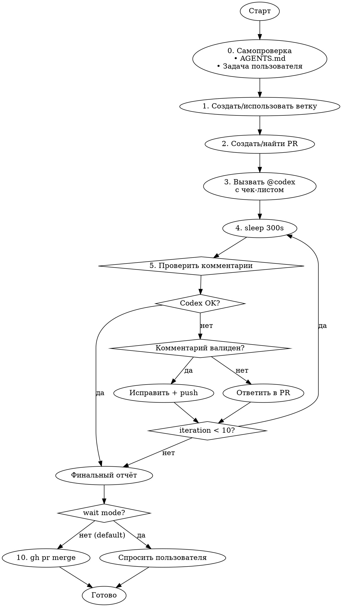

# PR с автоматическим code review от Codex

## Режимы

| Режим | Вызов | Поведение |
|-------|-------|-----------|
| **Auto (default)** | `/pullrequest` | Автоматически мержит после успешного review |
| **Wait** | `/pullrequest wait` | После review спрашивает пользователя о merge |

## Workflow



## Шаги

### 0. Самопроверка

**Перед созданием PR убедись:**

1. Прочитай `AGENTS.md` (или `CLAUDE.md`) — правила проекта
2. Вспомни изначальную задачу пользователя
3. Проверь: всё ли сделано? нет ли лишнего?

### 1. Ветка

```bash
# Если на main — создать feature-ветку
git checkout -b feature/<название>
```

### 2. PR

```bash
# Создать PR
gh pr create --title "..." --body "..."
# или найти существующий
gh pr list
```

### 3. Вызов Codex

Добавь комментарий в PR:

```bash
gh pr comment <номер> --body "@codex Please review this PR:

## Checklist
- [ ] **Bugs & Security**: logic errors, vulnerabilities, edge cases
- [ ] **Side Effects**: unintended changes in other parts of codebase
- [ ] **Consistency**: follows project patterns and code style
- [ ] **Documentation**: README, comments, docs updated if needed

Reply with 👍 if no issues found."
```

### 4. Ожидание

```bash
sleep 300  # 5 минут на review
```

### 5. Проверка комментариев и reviews

```bash
# Получить комментарии PR
gh api repos/{owner}/{repo}/pulls/{pr}/comments
gh api repos/{owner}/{repo}/issues/{pr}/comments
# Получить PR reviews (для обнаружения 👍/LGTM от Codex)
gh api repos/{owner}/{repo}/pulls/{pr}/reviews
```

### 6. Валидация комментария

**Валидно (исправляем):**
- Баг, уязвимость, ошибка логики
- Реальный side effect
- Нарушение стиля проекта
- Отсутствие обработки ошибок
- Недостающая документация

**Не валидно (отклоняем):**
- Субъективное мнение без обоснования
- Over-engineering для простой задачи
- Противоречит архитектуре проекта
- Устаревший или неверный совет

### 7. Действие

**Если валидно:**
```bash
# Исправить код
# git add + commit + push
gh pr comment <номер> --body "Fixed: <описание>"
```
Сообщить пользователю: что было → почему исправили

**Если не валидно:**
```bash
gh pr comment <номер> --body "Declined: <причина>"
```
Сообщить пользователю: что было → почему отклонили

### 8. Условия выхода

- Codex написал 👍 или "LGTM" или "No issues"
- Достигнут лимит 10 итераций
- Нет новых комментариев после последней проверки

### 9. Финальный отчёт

```markdown
### Итог PR Review
- **Итераций:** N
- **Исправлено:** M
- **Отклонено:** K
- **Статус:** готов к merge / требует внимания
```

### 10. Merge (зависит от режима)

**По умолчанию (auto) И статус "готов к merge":**
```bash
gh pr merge <номер> --squash --delete-branch
```
Сообщить пользователю: PR автоматически смержен.

**Если `wait` режим:**
Спросить пользователя: "PR готов к merge. Смержить?"
- Если да → `gh pr merge <номер> --squash --delete-branch`
- Если нет → оставить PR открытым
