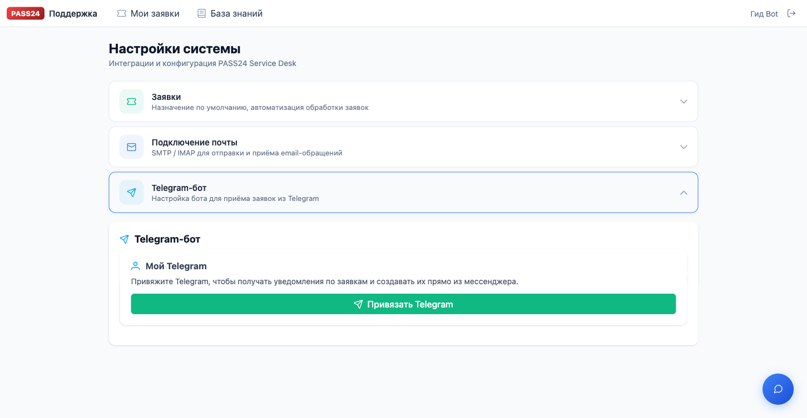
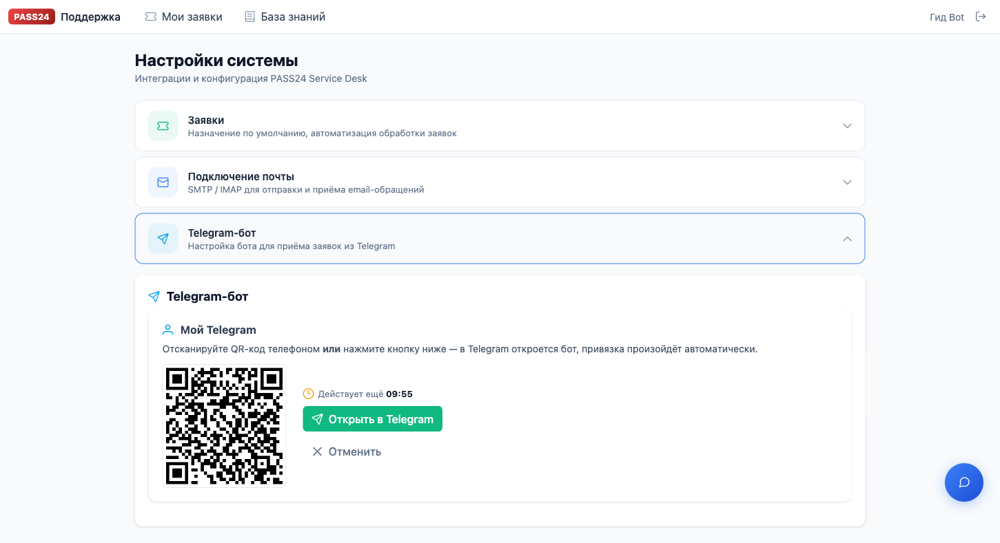

# PASS24 Service Desk — руководство по Telegram-боту

> Для жителей, сотрудников УК и менеджеров внедрения. Бот `@PASS24ROBOT` — основной канал самообслуживания: создавайте заявки, следите за статусом, получайте push-уведомления, общайтесь с AI-помощником и одобряйте фазы проектов прямо в Telegram.

<!--
Статус скриншотов (`agent_docs/screenshots/telegram/`):

| # | Файл | Источник | Готов |
|---|---|---|---|
| 01 | settings-telegram-idle.png | Playwright (portal) | ✅ |
| 02 | settings-telegram-qr.png | Playwright (portal) | ✅ |
| 03 | bot-linked-confirmation.png | Telegram-клиент | ⏳ нужен человек |
| 04 | settings-telegram-linked.png | Portal в linked-состоянии | ⏳ нужен человек |
| 05 | bot-main-menu.png | Telegram-клиент | ⏳ нужен человек |
| 06–12 | wizard-*.png | Telegram-клиент | ⏳ нужен человек |
| 13 | my-tickets-list.png | Telegram-клиент | ⏳ нужен человек |
| 14 | ticket-card.png | Telegram-клиент | ⏳ нужен человек |
| 15 | reply-prompt.png | Telegram-клиент | ⏳ нужен человек |
| 16 | close-confirm.png | Telegram-клиент | ⏳ нужен человек |
| 17–18 | csat-*.png | Telegram-клиент | ⏳ нужен человек |
| 19–20 | kb-*.png | Telegram-клиент | ⏳ нужен человек |
| 21 | ai-chat.png | Telegram-клиент | ⏳ нужен человек |
| 22–25 | projects-*.png, approval-*.png, reject-*.png | Telegram-клиент (PM) | ⏳ нужен человек |
| 26 | settings.png | Telegram-клиент | ⏳ нужен человек |
| 27 | unlink-confirm.png | Telegram-клиент | ⏳ нужен человек |

Как снимать:
1. **Portal** — Cmd+Shift+4 в macOS, положить в `agent_docs/screenshots/telegram/` с правильным именем
2. **Telegram** — сделать снимок в клиенте (iOS/Android/Desktop), обрезать до окна чата, сохранить с именем из таблицы
3. После сохранения — пересоберите Markdown, картинки вставятся автоматически
-->


## Оглавление

1. [Привязка аккаунта](#1-привязка-аккаунта)
2. [Главное меню](#2-главное-меню)
3. [Создание заявки (wizard)](#3-создание-заявки-wizard)
4. [Мои заявки — список и карточка](#4-мои-заявки--список-и-карточка)
5. [Ответ в заявку](#5-ответ-в-заявку)
6. [Закрытие заявки](#6-закрытие-заявки)
7. [Оценка решения (CSAT)](#7-оценка-решения-csat)
8. [Поиск в базе знаний](#8-поиск-в-базе-знаний)
9. [AI-помощник](#9-ai-помощник)
10. [Проекты и подтверждения (для PM)](#10-проекты-и-подтверждения-для-pm)
11. [Настройки уведомлений](#11-настройки-уведомлений)
12. [Отвязка аккаунта](#12-отвязка-аккаунта)
13. [Push-уведомления](#13-push-уведомления)
14. [FAQ и типичные ошибки](#14-faq-и-типичные-ошибки)

---

## 1. Привязка аккаунта

Чтобы пользоваться ботом, нужно один раз связать его с учёткой на портале. Связь одноразовая — пока вы её не разорвёте, бот будет узнавать вас автоматически.

### 1.1 В портале

Откройте `https://support.pass24pro.ru`, залогиньтесь, нажмите **Настройки** (иконка шестерёнки) → раздел **Telegram-бот**.



В разделе появится карточка «Мой Telegram» с кнопкой **Привязать Telegram**.

### 1.2 Генерация QR

Нажмите **Привязать Telegram** — портал сгенерирует одноразовую ссылку и покажет QR-код с таймером **10:00**.



Доступно два способа подтверждения:
- **Сканировать QR телефоном** — откроется Telegram с ботом и команда `/start <token>` уйдёт автоматически
- **Нажать «Открыть в Telegram»** — та же команда уйдёт в открытом клиенте

### 1.3 В Telegram

В открывшемся чате бот пришлёт команду `/start <token>` и через пару секунд подтвердит:

```
✅ Аккаунт привязан!

Добро пожаловать, <Ваше имя>.
```


Одновременно карточка в портале переключится в состояние **Подключён**:


### 1.4 Что если ссылка просрочилась

Если вы не успели за 10 минут — сгенерируйте новую. Лимит: **5 одновременно активных ссылок** на аккаунт. Просроченные или использованные сразу освобождают слот.

---

## 2. Главное меню

После привязки отправьте `/start` или нажмите «Меню» — бот покажет главное меню:

```
🏠 Главное меню

Выберите действие:

📝 Новая заявка
📋 Мои заявки • 3
📚 База знаний
🤖 Спросить AI
⚙ Настройки
```


Счётчик `• N` рядом с «Мои заявки» показывает число **незакрытых** заявок.

Для менеджеров с активными проектами появляется дополнительная кнопка:

```
🏗 Мои проекты • 2⏳
```

Где `N⏳` — количество ожидающих вашего подтверждения фаз.

---

## 3. Создание заявки (wizard)

Нажмите **📝 Новая заявка** — бот проведёт вас по 5 шагам.

### Шаг 1 — Продукт

```
📝 Новая заявка

Выберите продукт:

🏠 PASS24.online       📱 Мобильное приложение
🔑 PASS24 Key          📷 Распознавание
🚗 PASS24 Auto         🔌 Оборудование
🔗 Интеграции          ❓ Другое

                     [✕ Отмена]
```


### Шаг 2 — Категория

После выбора продукта бот покажет релевантные категории (список свой для каждого продукта).

Пример для мобильного приложения:

```
📝 📱 Мобильное приложение

Категория:

📱 Проблемы с приложением
🎫 Пропуска
📷 Распознавание
📝 Регистрация
💬 Консультация
❓ Другое

                     [⬅ Назад] [✕ Отмена]
```


### Шаг 3 — Описание и вложения

Бот попросит описать проблему. **Можно отправлять несколько сообщений подряд** — текст будет склеиваться. Прикрепляйте **скриншоты, видео, голосовые, документы** — всё долетит до агента.

Под приглашением появится статусная строка, которая обновляется после каждого вашего сообщения:

```
📝 Опишите проблему

Что произошло? Когда? Кто затронут? Пришлите текст
(можно несколькими сообщениями) и приложите скриншоты
по необходимости.

Минимум — 10 символов ИЛИ одно вложение.

       📝 47 симв.      📎 1 вложений
       [➡ Далее]
       [⬅ Назад] [✕ Отмена]
```


Кнопка **[➡ Далее]** становится активной, когда вы написали **≥10 символов** или прикрепили хотя бы один файл.

### Шаг 4 — Проверка базы знаний (автодефлекция)

Перед созданием заявки бот ищет ваш вопрос в базе знаний и, если что-то похожее нашлось, предлагает статью:

```
📚 Возможно, поможет одна из этих статей:

📄 1. Как добавить гостя в пропуск
📄 2. QR-код для разового пропуска
📄 3. Ограничение времени действия пропуска

[➡ Не помогло, создать заявку]
[⬅ Назад] [✕ Меню]
```


- **Нажмите на статью** — бот покажет её целиком
- После прочтения: **👍 Помогло** (заявка не создаётся) или **👎 Не помогло** (возврат к списку статей)
- **➡ Не помогло, создать заявку** — пропустить деф­лекцию, идти дальше

### Шаг 5 — Масштаб и срочность (необязательно)

```
⚖ Масштаб и срочность (необязательно)

Помогает автоматически определить приоритет.

Масштаб:
🌐 Все / весь объект    👥 Группа    👤 Только я

Срочность:
🔴 Немедленно    🟡 Сегодня    🟢 Может подождать

[⏭ Пропустить] [➡ Далее]
[⬅ Назад] [✕ Отмена]
```


Выберите Impact + Urgency — приоритет посчитается по ITIL-матрице. Или нажмите **[⏭ Пропустить]** — бот возьмёт разумные значения по умолчанию.

### Шаг 6 — Подтверждение

```
📝 Подтвердите создание заявки

Продукт: 📱 Мобильное приложение
Категория: 📱 Проблемы с приложением
Масштаб: 👤 Только я
Срочность: 🟡 Сегодня
Вложения: 2

Описание:
Не приходит SMS-код при регистрации нового пользователя.
Телефон +7..., пробовал 3 раза...

[✅ Отправить]
[✏ Изменить описание]
[✕ Отмена]
```


Нажимаете **✅ Отправить** — заявка создана:

```
✅ Заявка #a1b2c3d4 создана
🔵 NORMAL • 🔵 Новая
SLA ответа: до 14:30 (через 3ч 42м)

[📋 Открыть карточку] [🏠 Меню]
```


---

## 4. Мои заявки — список и карточка

Из главного меню → **📋 Мои заявки**.

### Фильтры и пагинация

```
📋 Мои заявки — 🟢 Активные (всего 7)

🔵 #a1b2c3d4 — Не приходит SMS
🟡 #f5e4d3c2 — Ошибка 500 при входе в приложение
🟠 #9876fedc — Не работает распознавание номеров
✅ #aabbccdd — Запрос на подключение нового адреса
🟡 #11223344 — Массовая рассылка не отправляется

[✓ 🟢 Активные] [📋 Все] [⚫ Закрытые]

#a1b2c3d4   #f5e4d3c2   #9876fedc ...

[◀ Пред] Стр 1/2 [След ▶]

[🏠 Меню]
```


- Фильтры: **Активные** / **Все** / **Закрытые**
- Клик по `#id` открывает карточку заявки
- Пагинация — 5 заявок на странице

### Карточка заявки

```
🔵 Заявка #a1b2c3d4
Статус: Новая • Приоритет: 🔵 NORMAL

Продукт: 📱 Мобильное приложение
Категория: Проблемы с приложением
Создана: 17.04.2026 10:48

Описание:
Не приходит SMS-код при регистрации нового пользователя...

💬 Комментарии 1–3 из 5

Иван Иванов (агент) · 17.04 11:02
Здравствуйте! Пробовали перезапустить приложение?

Вы · 17.04 11:05
Да, перезапускал. Не помогло.

...

[💬 Ответить] [📎 Вложение]
[✕ Закрыть]
[⬅ К списку] [🏠 Меню]
```


Если комментариев больше 5, внизу появится кнопка **[⬇ Ещё комментарии]**.

Для заявок в статусе **Решена** карточка содержит кнопку **⭐ Оценить**.

---

## 5. Ответ в заявку

В карточке — нажмите **💬 Ответить** или **📎 Вложение** (разница только в тексте приглашения).

```
💬 Ответ в заявку #a1b2c3d4

Пришлите сообщение — можно текст и/или вложения.
Когда закончите, нажмите «Отправить».

       📝 23 симв.      📎 0 вложений
       [➡ Отправить]
       [✕ Отмена]
```


Отправляете всё что нужно (текст, фото, голосовые), потом **➡ Отправить**. Счётчики и кнопка обновляются после каждого вашего сообщения.

Автоматические побочные эффекты:
- Заявка помечается `has_unread_reply=True` — агент видит выделенной
- Если статус был **Ждёт ответа** → автопереход в **В работе**
- SLA-таймер возобновляется (если был на паузе)

---

## 6. Закрытие заявки

Только пользователь — автор заявки — может закрыть её из бота.

Нажимаете **✕ Закрыть** → бот попросит подтверждение:

```
⚠ Точно закрыть заявку?

После закрытия переоткрыть её нельзя —
придётся создать новую.

[✅ Да, закрыть] [✕ Нет]
```


---

## 7. Оценка решения (CSAT)

Когда агент помечает заявку **Решена**, бот присылает push:

```
✅ Статус заявки #a1b2c3d4
Ошибка 500 при входе

В работе → Решена

[⭐] [⭐⭐] [⭐⭐⭐] [⭐⭐⭐⭐] [⭐⭐⭐⭐⭐]
[📋 Открыть]
```

Либо можно зайти в карточку и нажать **⭐ Оценить**:

```
⭐ Оцените решение

Насколько вы довольны результатом?

[⭐] [⭐⭐] [⭐⭐⭐] [⭐⭐⭐⭐] [⭐⭐⭐⭐⭐]
[⬅ Назад]
```


- **4-5 звёзд** — оценка сохраняется мгновенно, заявка переходит в Closed
- **1-3 звезды** — бот попросит рассказать, что можно улучшить (или **[⏭ Пропустить]**)

```
⭐⭐⭐

Расскажите, что можно улучшить?
(или нажмите «Пропустить»)

[⏭ Пропустить]
```


Если вы не оцените заявку в течение 24 часов, бот напомнит одним push-сообщением.

---

## 8. Поиск в базе знаний

Главное меню → **📚 База знаний**.

```
📚 База знаний

Напишите, что ищете (2–3 слова достаточно).

[🏠 Меню]
```

Введите запрос (например, `смс код`). Бот покажет до 5 статей с краткими описаниями:

```
📚 Результаты для: «смс код»

📄 Не приходит SMS при регистрации
app_issues

📄 Верификация по SMS — как это работает
passes

📄 Альтернативы SMS — BLE-ключи PASS24.Key
pass24_key

[📄 1. Не приходит SMS...]
[📄 2. Верификация по SMS...]
[📄 3. Альтернативы SMS...]
[📝 Не нашёл — создать заявку]
[🏠 Меню]
```


Клик по статье — полный текст + оценка:

```
📄 Не приходит SMS при регистрации

1. Проверьте, что номер введён корректно (10 цифр без +7)
2. Подождите минуту — SMS может идти дольше при высокой нагрузке
3. Если через 3 минуты нет — запросите повторно
...

[👍 Помогло] [👎 Не помогло]
[📝 Создать заявку по теме]
[⬅ Назад к результатам] [🏠 Меню]
```


---

## 9. AI-помощник

Главное меню → **🤖 Спросить AI**.

```
🤖 AI-помощник

Задайте вопрос — я постараюсь помочь, опираясь на базу знаний.

[⬅ Выйти в меню]
```

Пишете вопрос — бот отвечает. Отвечает на основе базы знаний (RAG) + Claude.

```
📝 Как мне настроить автоматический пропуск для регулярного гостя?

Для автоматического пропуска для регулярного гостя:

1. Откройте раздел «Пропуска» в мобильном приложении
2. Создайте пропуск типа «Постоянный»
3. Выберите расписание (по дням недели или диапазон дат)
...

📚 Источники:
[📄 Постоянные пропуска]
[📄 Расписание для гостя]

[📝 Создать заявку] [⬅ Выйти]
```


Диалог хранит **6 последних реплик** — можно уточнять, не повторяя контекст.

Если AI не смог решить проблему, **[📝 Создать заявку]** откроет wizard с предзаполненным описанием на основе вашего последнего вопроса.

---

## 10. Проекты и подтверждения (для PM)

Раздел виден только пользователям с ролью **property_manager**, у которых есть `customer_id` (привязка к клиенту-компании).

Главное меню → **🏗 Мои проекты**.

```
🏗 Мои проекты (2 активных, 1⏳ ожидает подтверждения)

🏗 PRJ-00123  ЖК «Солнечный» — запуск СКУД
    Фаза: Настройка ПО (4/10)  ⏳ 1 ожидает

🏗 PRJ-00124  БЦ «Октант» — расширение
    Фаза: Монтаж (3/8)

[🏗 Открыть PRJ-00123]
[🏗 Открыть PRJ-00124]
[🏠 Меню]
```


### Карточка проекта

```
🏗 PRJ-00123 — ЖК «Солнечный»

Тип: Жилой комплекс
Статус: В работе
Прогресс: ▓▓▓▓░░░░░░ 40%
Текущая фаза: Настройка ПО

[🏗 Фазы] [📎 Документы] [⚠ Риски]
[✅ На подтверждении (1)]
[⬅ К списку] [🏠 Меню]
```


### Подтверждение фазы

Когда агент отмечает фазу как **Completed**, PM получает push:

```
✅ Требуется подтверждение фазы

Проект: ЖК «Солнечный»
Фаза: Настройка ПО

[✅ Утвердить] [❌ Отклонить]
```


- **✅ Утвердить** — немедленное действие (без подтверждения)
- **❌ Отклонить** — бот запросит причину текстом

```
Укажите причину отклонения:

(напишите текстом)
[⏭ Отмена]
```


После принятия решения фаза переходит в соответствующий статус, а агент получает уведомление на портале.

---

## 11. Настройки уведомлений

Главное меню → **⚙ Настройки**.

```
⚙ Настройки

Email: user@example.com
Привязан: с 15.04.2026

Уведомления:
🟢 💬 Ответы по заявкам
🟢 📊 Изменения статуса
🟢 ⚠ Предупреждения SLA
🟢 ⭐ Запросы оценки
🟢 ✅ Запросы на подтверждение
🟢 🏁 Завершение фаз
🟢 🛑 Риски в проектах

[🔗 Отвязать аккаунт]
[🏠 Меню]
```


Клик по любой строке переключает `🟢 ON ↔ ⚫ OFF`. Отключённые типы уведомлений не будут отправляться.

---

## 12. Отвязка аккаунта

В настройках → **🔗 Отвязать аккаунт** → подтверждение:

```
⚠ Отвязать Telegram от аккаунта?

После этого бот перестанет присылать уведомления.

[✅ Да, отвязать] [✕ Отмена]
```


После отвязки бот не будет знать, кто вы. При следующем `/start` он предложит привязаться заново.

---

## 13. Push-уведомления

Бот автоматически присылает:

| Событие | Что придёт | Управление |
|---|---|---|
| Новый комментарий в заявке | Текст, автор, кнопка «Ответить» | `notify_comment` |
| Изменение статуса | Старый → новый статус | `notify_status` |
| SLA под угрозой (30 мин) | Дедлайн + срочность | `notify_sla` |
| Заявка решена | + 5-звездочный CSAT inline | `notify_csat` |
| Новый approval на фазу | Кнопки «Утвердить/Отклонить» | `notify_approval` |
| Фаза завершена | Название фазы | `notify_milestone` |
| Риск добавлен | Описание + severity emoji | `notify_risk` |

Все типы можно включить/выключить в **⚙ Настройки**. По умолчанию все включены.

---

## 14. FAQ и типичные ошибки

### QR-код исчезает сразу после появления
Закройте вкладку и откройте настройки заново. Возможно, старая JS-версия браузера — **Cmd+Shift+R** (hard reload).

### «Слишком много запросов. Попробуйте позже»
Лимит 5 одновременных активных инвайтов. Подождите 10 минут — старые истекут и освободят слот.

### Бот отвечает «Ссылка недействительна»
- Ссылка использована (один раз — и всё)
- Прошло больше 10 минут
- Браузер обрезал `?start=...` при открытии

Сгенерируйте новую.

### В боте пишу, но он отвечает «Добро пожаловать» снова и снова
Вы не привязаны. Нажмите **🔗 Привязать аккаунт**, пройдите flow из § 1.

### Разорвал связь и не получаю уведомлений
Зайдите в Настройки портала → Telegram-бот → «Привязать Telegram» заново. Старые токены с того же chat_id обновляются при повторной привязке.

### Бот в compat-режиме (2 недели после rollout)
Если вы пишете боту без привязки, он создаст ghost-заявку (как раньше) и напомнит про привязку. Эта опция отключается вручную через 2 недели после деплоя.

---

## Вопросы и поддержка

- **По работе бота:** `support@pass24online.ru`
- **Портал с заявками:** https://support.pass24pro.ru
- **Ручное создание заявки:** https://support.pass24pro.ru/tickets/create
